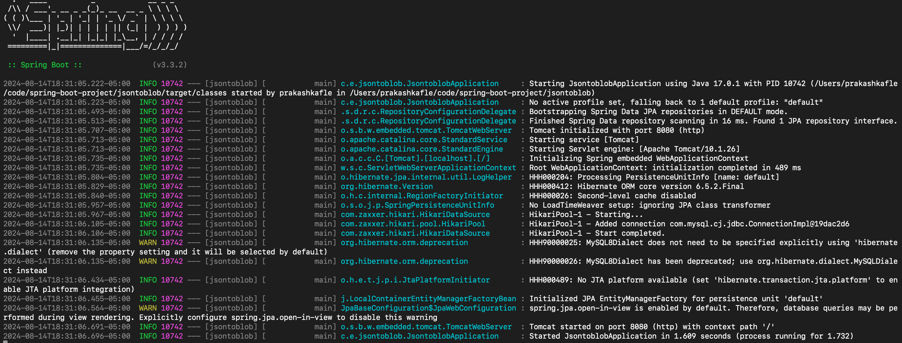
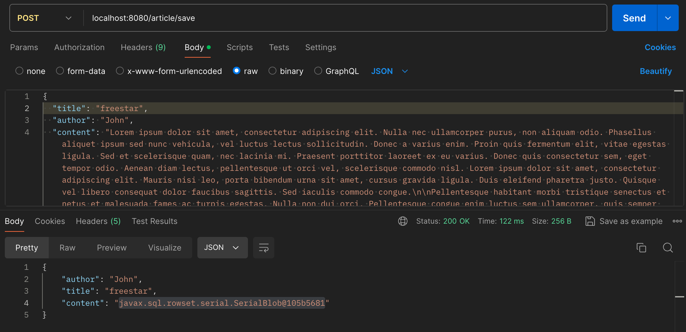
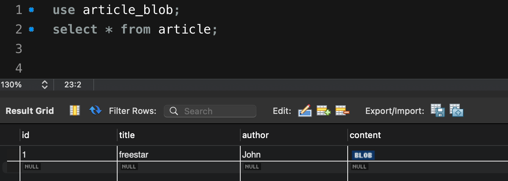
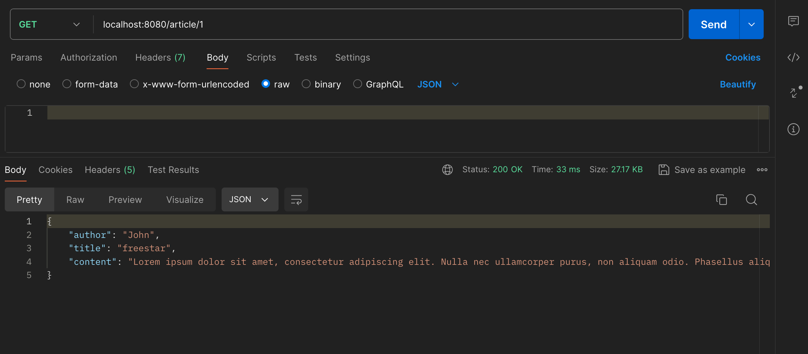

# Spring Boot Application Setup

## Overview

This document provides instructions on how to run the Spring Boot application, including details on configuring `application.properties` and `.sql` files. You will also find code snippets and a guide on using the POST API.

#### A database schema with table is required in database. I have ran the following query in mysql.

```bash
-- SQL schema for the article_blob database

CREATE DATABASE article_blob;

USE article_blob;

CREATE TABLE IF NOT EXISTS articles (
id BIGINT AUTO_INCREMENT PRIMARY KEY,
title VARCHAR(255) NOT NULL,
content BLOB
);
```
## Configuration Files

### `application.properties`

To configure the Spring Boot application, use the following properties in your `application.properties` file:
#### Replace url with your schema url if you are using other than article_blob.
#### Replace with your username and password.

```bash
spring.datasource.url = jdbc:mysql://localhost:3306/article_blob
spring.datasource.username = root
spring.datasource.password = password

spring.jpa.properties.hibernate.dialect = org.hibernate.dialect.MySQL8Dialect
spring.jpa.hibernate.ddl-auto = update
```
## Running the Spring Boot Application

To start the Spring Boot application, follow these steps:

 **Build and Run**: Open your terminal, navigate to your project directory, and run the following command:

    ```bash
    ./mvnw spring-boot:run
    ```

   This will start the application on `localhost:8080`.




*** **_GET REQUEST_**

   **Send a POST Request**: Use Postman to send a POST request to `http://localhost:8080/article/save`.

   **Sample Request Body: Use file article.json from assets folder**




**Verify your database** : See if the content is stored as blob
 ```bash
   select * from article;
 ```




*** **_GET REQUEST_** 

**Send a** **GET** **Request**: Use Postman to send a GET request to `http://localhost:8080/article/1`.

This request get all the data from the database and converts into json.




